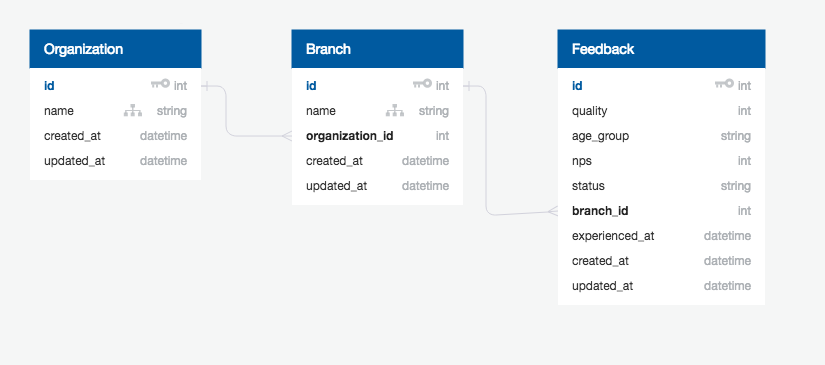
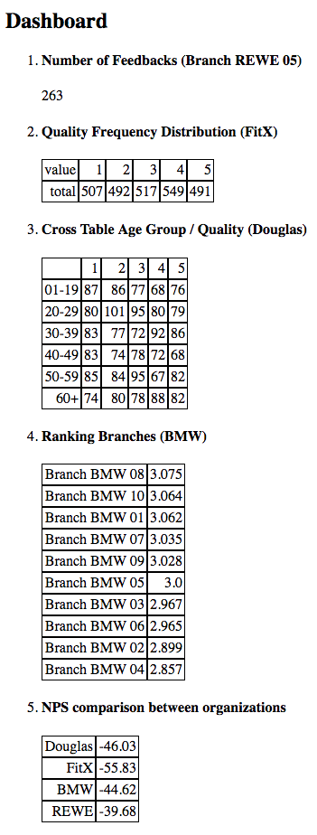

# Aptitude Assessment

## Intent

The aim is to assess the applicant's level of skills and knowledge which he requires to deal with everyday tasks when working for SayWay. The tasks are designed such that it should not be possible to complete the assignment perfectly, i.e., it is an open ended assignment.
It is important that the candidate approaches the assignment with this in mind. He will not only be assessed by how much he could solve, the way he went about it is just as important.

## Overview

We have prepared a MacBook Pro with an editor (Atom), git and a sample Rails application. The correct git branch is already checked out, where you should commit your changes to.

The Rails application has three models according to the following database schema.

There is already a `dashboard_controller` and a corresponding route and view which can be used for solving the tasks.

The sample database contains four organizations (_Douglas_, _FitX_, _BMW_, _REWE_), 40 branches (each organization has 10 branches) and 10.000 feedbacks.

Each feedback belongs to a branch of an organization.

Each organization has made a customer survey w.r.t. a questionnaire with following questions:

1. How satisfied are you with our quality? (rating 1 to 5)
2. How old are you? (01-19, 20-29, 30-39, 40-49, 50-59, 60+)
3. Regarding today's visit, how likely is it that you would recommend our service to your friends? (rating 0 to 10)

The latter is a common question in market research and it is used to calculate the `Net Promoter Score`, in short `NPS`.

Data is saved in table `feedbacks` w.r.t. attributes `quality`, `age_group`, `nps` together with meta attributes

- `status` (one of `valid` or `canceled`)
- `experienced_at` (timestamp of feedback)
- `branch` (in which branch feedback was taken)

The former two meta attributes are not important for this test and need not to be considered.

## Task

The task is to implement a single page where some aggregated reports (mainly tables) of the collected feedbacks are listed.

__Important__: Don't forget to commit your changes.

1. Calculate the number of feedbacks of branch `Branch REWE 05`.

2. Determine the frequency distribution of organization `FitX ` w.r.t. `quality`.

3. Determine a cross table for `Douglas` w.r.t. `age group` and `quality` where entries are numbers of feedbacks.

4. Determine a ranking for all branches of `BMW` w.r.t. average of `quality`.

5. Calculate all net promoter scores* for all organizations and display them in a table.

_*CALCULATION OF NPS: Those who respond to a NPS question with a score of 9 to 10 are called Promoters, and are considered likely to exhibit value-creating behaviors, such as buying more, remaining customers for longer, and making more positive referrals to other potential customers. Those who respond with a score of 0 to 6 are labeled Detractors, and they are believed to be less likely to exhibit the value-creating behaviors. Responses of 7 and 8 are labeled Passives, and their behavior falls between Promoters and Detractors. The Net Promoter Score is calculated by subtracting the percentage of customers who are Detractors from the percentage of customers who are Promoters._

## Preview

This is how your report should look like (note: totals will be different due to randomization):

